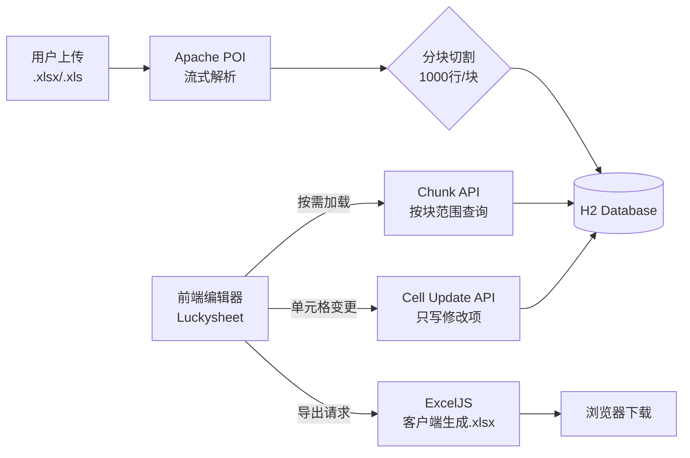

<div align="center">

# 🧵 DataLoom

**像织布一样，把数据编织成表格**

一个从零构建的在线 Excel 协作系统——上传、编辑、导出，十万级数据也能流畅操作。

[](#)
[](#)
[](#)
[](#)
[](#license)

[快速开始](#-getting-started) &nbsp;·&nbsp;
[API 文档](#-api-reference) &nbsp;·&nbsp;
[在线演示](https://github.com/your-username/DataLoom) &nbsp;·&nbsp;
[报告 Bug](https://github.com/your-username/DataLoom/issues) &nbsp;·&nbsp;
[请求功能](https://github.com/your-username/DataLoom/issues)

</div>

---

## 📖 目录

- [关于项目](#-about-the-project)
- [特性](#-features)
- [技术栈](#-built-with)
- [架构设计](#-architecture)
- [快速开始](#-getting-started)
- [API 参考](#-api-reference)
- [目录结构](#-directory-structure)
- [路线图](#-roadmap)
- [贡献指南](#-contributing)
- [许可证](#-license)

## 🧐 About The Project

你有没有遇到过这种场景：公司内网的 Excel 文件满天飞，"最终版""最终版_v2""绝对不改了_final"层层嵌套；好不容易找人协作，合并版本时又把人整崩溃。

市面上的在线表格方案，要么是微软、Google 的 SaaS，数据出不了公司，老板不批；要么是私有化部署动不动六位数起，还得搭个服务器集群。我就想做个轻量级的——能跑在本地、大文件不卡、样式不丢，够用就行。

**这就是 DataLoom。**

> "Loom" 是织布机。Excel 的数据像纱线一样被编织进表格里，分块、加载、编辑、导出——每一步都在"编织"。

### 为什么不用现成的？

| 方案 | 问题 |
|------|------|
| Microsoft 365 / Google Sheets | 数据不能留在本地，合规过不了 |
| 企业版私有部署 | 贵，而且重——不需要 90% 的功能 |
| 纯 Luckysheet 前端 | 刷新全丢，没有持久化 |
| 后端存整表 JSON | 10 万行的 JSON 字段能把数据库撑爆 |

**DataLoom 的做法**：Luckysheet 做编辑器，Spring Boot 做后端，数据按 1000 行一块拆开存——既保留了 Luckysheet 的全套编辑能力，又不让数据库背大 JSON 的锅。

([返回顶部](#-dataloom))

## ✨ Features

- 📤 **上传即用** — 拖入 `.xlsx` / `.xls` 文件，自动解析多 Sheet、公式、合并单元格、列宽
- 🧩 **分块存储** — 每 1000 行一个数据块，10 万行 = 100 个块，编辑时只更新一个块
- ⚡ **懒加载** — 前端按需加载数据块，打开大文件几乎无等待
- 🖊️ **类 Excel 编辑器** — 基于 Luckysheet，支持公式计算、合并单元格、格式刷、筛选排序
- 💾 **前端导出** — 使用 ExcelJS 直接从编辑器状态导出，字体、颜色、边框一个不丢
- 🗄️ **零配置数据库** — H2 嵌入式数据库，启动即用，无需装 MySQL/PostgreSQL
- 📝 **脏数据追踪** — 只保存实际修改过的单元格，不是全量覆盖

([返回顶部](#-dataloom))

## 🛠️ Built With

| 层 | 技术 | 角色 |
|---|------|------|
| 后端 | Spring Boot 2.1 + MyBatis-Plus 3.3 | REST API + ORM |
| 数据库 | H2（文件模式） | 嵌入式数据库，零配置 |
| Excel 解析 | Apache POI 4.1 | 服务端解析上传的 Excel 文件 |
| 前端框架 | Vue 3.5 + Vite 6 | Composition API + ESM |
| UI 组件 | Element Plus 2 | 界面组件库 |
| 表格引擎 | Luckysheet 2.1 | 类 Excel 在线编辑器 |
| 前端导出 | ExcelJS 4.4 | 客户端生成 `.xlsx` |
| 运行时 | JDK 8 / Node.js 18+ | Java 服务端 + Node 开发环境 |

([返回顶部](#-dataloom))

## 🏗️ Architecture

### 数据流转



### 为什么分块？

```
excel_document        文档（文件名、大小、创建时间）
  ├── excel_sheet     工作表（Sheet名、合并单元格、列宽等元信息）
  │   ├── chunk_1     第 1~1000 行 → celldata JSON
  │   ├── chunk_2     第 1001~2000 行
  │   ├── chunk_3     第 2001~3000 行
  │   └── ...
  └── sheet_2         第二张表
      └── ...
```

对比一下整表存 JSON 的方案：

| | 整表 JSON | 分块存储 |
|---|---|---|
| 10 万行查询 | 一次拉取几十 MB | 单次只拉需要的块，几百 KB |
| 修改一个单元格 | 序列化整张表再写回 | 只更新一个 1000 行的块 |
| 并发编辑 | 几乎无解 | 块级锁，互不干扰 |
| 数据库压力 | JSON 字段膨胀，索引失效 | 普通表结构，正常索引 |

([返回顶部](#-dataloom))

## 🚀 Getting Started

### 前置要求

在开始之前，确保你的开发环境满足：

- **JDK 8+**
- **Maven 3.x**
- **Node.js 18+**（推荐）

```bash
# 验证环境
java -version
mvn -version
node -v
```

### 三步跑起来

<details>
<summary><b>1. 克隆仓库</b></summary>

```bash
git clone https://github.com/your-username/DataLoom.git
cd DataLoom
```
</details>

<details>
<summary><b>2. 启动后端</b></summary>

```bash
cd excel-service-demo
mvn spring-boot:run
```

后端启动在 `http://localhost:9191`。首次运行会自动创建 H2 数据库文件。

> 🔍 H2 控制台：`http://localhost:9191/h2-console`  
> JDBC URL: `jdbc:h2:file:./data/excel-demo` | 用户名: `sa` | 密码留空
</details>

<details>
<summary><b>3. 启动前端</b></summary>

```bash
cd excel-web-demo
npm install
npm run dev
```

前端启动在 `http://localhost:8081`。Vite 开发服务器会自动将 `/api` 请求代理到后端 `9191` 端口。
</details>

打开浏览器访问 `http://localhost:8081`，上传一个 Excel 文件试试。

([返回顶部](#-dataloom))

## 📡 API Reference

所有接口路径前缀 `/api/excel`，请求体均为 `application/json`。

### 文档管理

| 方法 | 路径 | 说明 |
|------|------|------|
| `POST` | `/upload` | 上传 Excel 文件（`multipart/form-data`），解析后分块入库 |
| `GET` | `/document/list` | 分页获取文档列表 |
| `GET` | `/document/{id}` | 获取文档元信息和 Sheet 列表 |
| `PUT` | `/document/{id}/name` | 重命名文档 |
| `DELETE` | `/document/{id}` | 软删除文档（级联清理 Sheet 和块数据） |

### 数据读写

| 方法 | 路径 | 说明 |
|------|------|------|
| `GET` | `/document/{id}/sheet/{sheetId}/all` | 加载 Sheet 全部 celldata |
| `GET` | `/document/{id}/sheet/{sheetId}/chunks` | 按块索引范围加载（`?start=0&end=2`） |
| `PUT` | `/document/{id}/sheet/{sheetId}/cell` | 更新单个单元格 |
| `PUT` | `/document/{id}/cells/batch` | 批量更新单元格 |

> ⚠️ Excel 导出由前端 `ExcelJS` 完成，不走后端。原因是 Luckysheet 的样式信息（字体、颜色、边框等）存在于前端编辑器状态中，后端拿不到——用前端导出才能做到**样式零丢失**。

([返回顶部](#-dataloom))

## 📁 Directory Structure

```
DataLoom/
├── excel-service-demo/         # Spring Boot 后端
│   ├── pom.xml                 # Maven 依赖配置
│   └── src/main/
│       ├── java/com/demo/excel/
│       │   ├── controller/     # REST 控制器（上传/文档 CRUD/单元格读写）
│       │   ├── entity/         # JPA 实体（Document/Sheet/Chunk）
│       │   ├── mapper/         # MyBatis-Plus Mapper 接口
│       │   └── service/        # 业务逻辑（POI 解析/分块存储/单元格更新）
│       └── resources/
│           ├── application.yml # Spring Boot 配置
│           └── schema.sql      # H2 建表语句
├── excel-web-demo/             # Vue 3 前端
│   ├── package.json
│   ├── vite.config.js          # Vite 配置（含 API 代理）
│   └── src/
│       ├── api/                # Axios API 封装
│       ├── router/             # Vue Router 4 路由配置
│       ├── utils/              # ExcelJS 导出工具
│       └── views/              # 页面组件（文档列表 + 表格编辑器）
├── .gitignore
└── README.md
```

([返回顶部](#-dataloom))

## 🗺️ Roadmap

- [x] Excel 文件上传与 POI 流式解析
- [x] 分块存储（1000 行/块）
- [x] 基于 Luckysheet 的在线编辑器
- [x] 单元格编辑与脏数据追踪
- [x] 前端 ExcelJS 导出（样式零丢失）
- [x] Vue 3 迁移（Composition API + Vite）
- [ ] 多人协同编辑（OT 算法 / CRDT）
- [ ] H2 → MySQL/PostgreSQL 迁移方案
- [ ] 单元格级操作历史（撤销/重做跨会话）
- [ ] Docker 一键部署
- [ ] 权限管理（文档级读写控制）
- [ ] WebSocket 实时同步

查看完整的 [Issues 列表](https://github.com/your-username/DataLoom/issues) 了解更多。

([返回顶部](#-dataloom))

## 🤝 Contributing

开源社区的贡献让软件更有生命力。欢迎任何形式的参与——提 Issue、改代码、完善文档都算。

1. Fork 本项目
2. 创建你的特性分支 (`git checkout -b feature/AmazingFeature`)
3. 提交你的改动 (`git commit -m 'Add some AmazingFeature'`)
4. 推送到分支 (`git push origin feature/AmazingFeature`)
5. 发起一个 Pull Request

([返回顶部](#-dataloom))

## 📝 License

本项目基于 MIT License 开源——基本上你可以随便用，改代码、商用都行，保留版权声明就好。

详见 [LICENSE](LICENSE) 文件。

([返回顶部](#-dataloom))

---

<div align="center">

**🧵 DataLoom** — 像织布一样，把数据编织成表格

如果这个项目帮到了你，点个 ⭐ Star 支持一下

</div>
