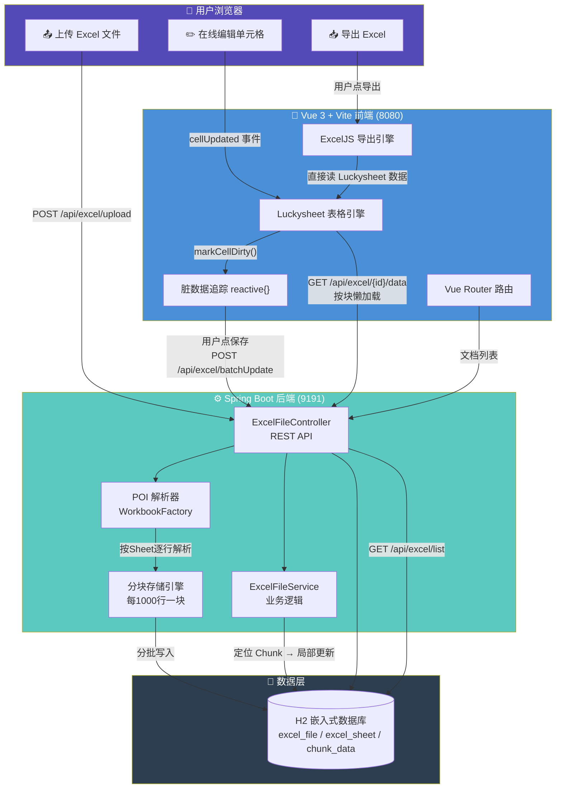
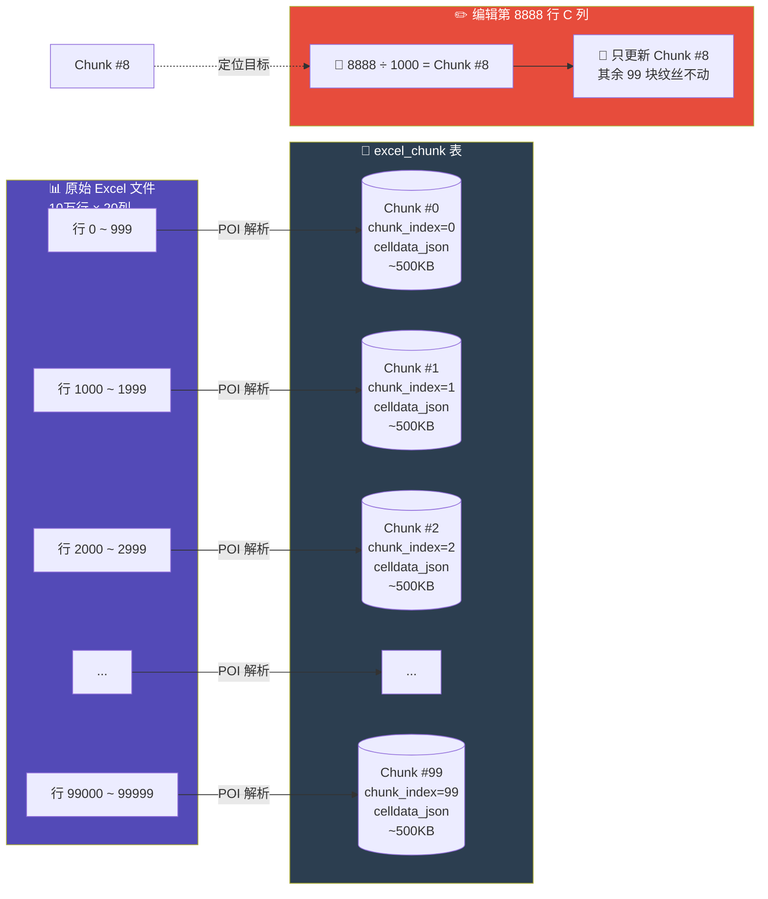
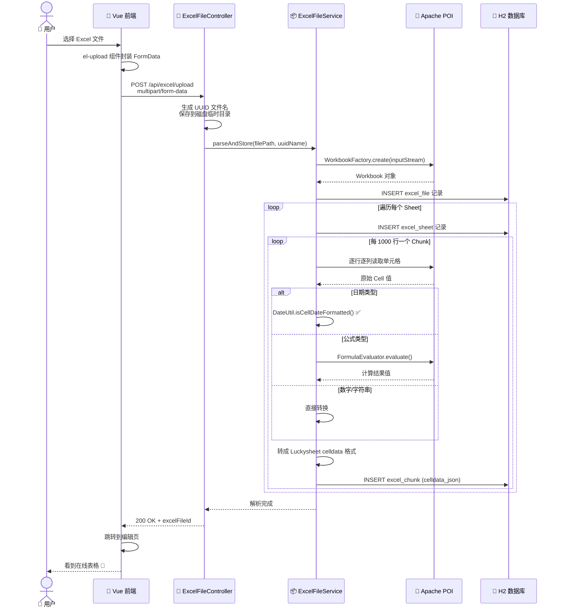
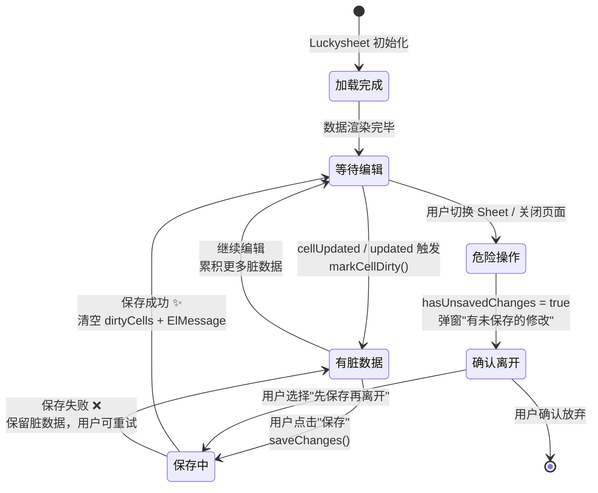
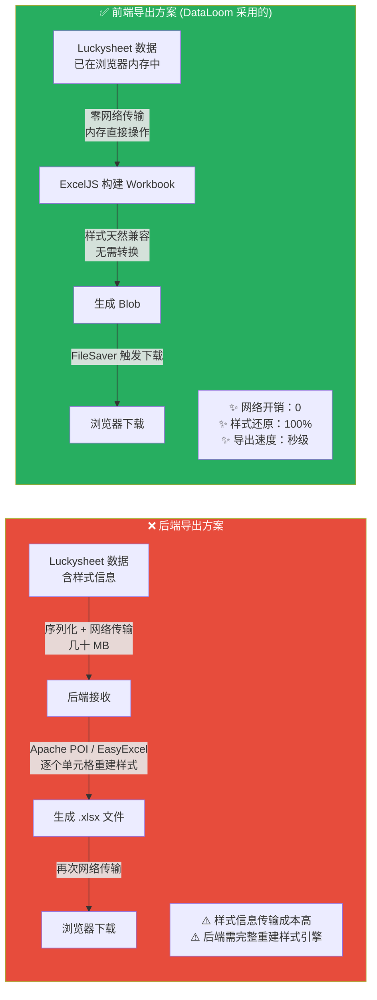
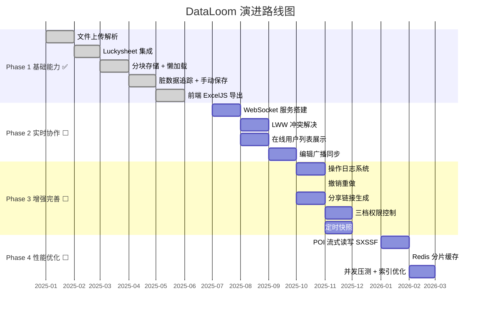

# 从零构建在线Excel：一个Java全栈工程师的实战记录

> 🔗 项目地址：https://github.com/DevYangJC/DataLoom  
> 完整源码、README、路线图均可在仓库中找到。

## 我为什么要自己造这个轮子

说出来你可能不信，起因是公司内部一堆Excel文件满天飞。

财务部的预算表、运营部的数据看板、产品部的需求矩阵——每一次改一个数，就要在微信上重新传一遍文件。文件名从"最终版"进化到"最终最终版"再到"打死也不改了版"，像极了程序员给变量起名。

市面上不是没有在线表格产品，腾讯文档、飞书表格都挺好用。但公司内网环境不允许直连外部服务，数据又不能出内网。私有化部署的那些方案，要么贵得离谱，要么定制成本太高。

于是我决定自己动手。一个全栈工程师的自我修养，不就是"没人做我来做"吗？

## 不止是我用：这个项目给你的价值

要说清楚这件事——我不是在做一个"我的项目"，我是在做一个"你也能用的零件"。

大多数技术教程里的项目，你照着写完就跑不起来了。要么跟作者的数据库强绑定，要么前端和后端耦合得像连体婴儿，要么硬编码了一堆作者公司才有的配置。说白了，那些代码离开作者的电脑就是个摆设。

DataLoom 从一开始就被设计成**可移植的**。什么意思？就是当你自己的项目需要一个在线表格功能时，你能把这个项目直接复制粘贴进去，改改配置就能跑，不用从零攻坚。

具体来说，我刻意做了这么几件事：

**前端是一个独立的 SPA 应用。** 它不依赖特定的后端框架，跟后端只通过 REST API 通信。你后端是 Spring Boot、Go、Node，甚至 Python Flask，都无所谓——把 `excel-web-demo/src` 目录往你项目里一扔，配个 API 代理就行。前端不认后端是谁，只认 `/api/excel` 这个前缀。

**后端是一个独立的微服务。** 它有自己的端口（9191）、自己的数据库（H2），不跟你现有的业务代码搅在一起。你甚至不需要碰它的 Java 代码——启动一个 JAR 包，在线表格能力就有了。等业务量大了想替换掉 H2，改一行 `application.yml` 的数据库配置，MyBatis-Plus 自动适配，SQL 一行不用改。

**数据模型解耦干净。** 文档、Sheet、数据块三张表之间只用外键关联，不写存储过程、不依赖触发器、不用数据库专有特性。换成任何关系型数据库都只要建三张表，改改连接串就行。

**启动链路就是一个 shell 脚本的事。** 后端 `mvn spring-boot:run`，前端 `npm run dev`。如果打包成 Docker，就是一个 `docker-compose.yml`，两行 `services` 搞定。你的团队成员 clone 下来，两分钟之内就能在本地跑到"上传 → 编辑 → 导出"的完整闭环。

说白了，**DataLoom 不是你照着学的玩具项目，是你抄来就用的功能模块。** 你项目的管理后台缺一个数据看板？把一个 Excel 当模板上传进去，线上改数据、导出报表，直接搞定。你自己的 SaaS 产品需要给客户提供表格编辑能力？把这两个目录放进你的微服务集群，注册个域名，齐活。源码已开源在 GitHub，地址开头有，clone 下来配置都不用改就能跑。

后面讲的技术细节——分块存储、脏数据追踪、前端导出——都是在保证"能用"的前提下，做到"好用"。但"能用"这件事，在架构设计阶段就已经写死进去了。

## 技术选型：少即是多

需求其实很明确：上传Excel → 在线编辑 → 导出Excel。听起来简单，但细节全是坑。

**前端**，Vue 3 + Vite + Element Plus。Vue 3的Composition API是这次选型里我最满意的决定——`<script setup>`语法写起来比Options API清爽太多了，逻辑拆成独立函数，不用再在`data`、`methods`、`computed`之间来回跳。Vite替代Webpack，冷启动和热更新都快了一个量级，改一行代码瞬间看到效果，开发体验上了不止一个台阶。

核心的表格渲染引擎，我锁定了[Luckysheet](https://github.com/dream-num/Luckysheet)。这是国内团队做的一个开源在线电子表格，长得跟Excel几乎一模一样。说实话，看到它的demo那天我差点没睡着——这不就是我要的东西吗？支持单元格编辑、公式计算、合并单元格、条件格式，甚至连图表都有。后来这个项目被字节跳动收购了，演变成了现在的Univer，但早期开源版本依然很好用。

**后端**，Spring Boot 2.1 + MyBatis-Plus，老牌组合，稳得一批。Java 8，不用解释。

关键的选择在**Excel解析和导出**这两块。解析选了Apache POI，老牌选手，虽然API丑得像上个世纪的东西，但胜在稳定，Excel 97到2007+通吃。导出我走了另一条路——前端用ExcelJS，后端用EasyExcel做补充。为什么？因为Luckysheet的数据在前端，前端的ExcelJS可以直接拿到每个单元格的样式信息（字体、颜色、边框），导出的效果几乎100%还原。如果走后端导出，光是把样式信息传到后端就够喝一壶的。

**数据库**，Demo阶段直接用H2嵌入式数据库，零配置启动。等你把代码clone下来，`mvn spring-boot:run`一行命令就能跑起来，MySQL都不用装。

### 一图看全貌：现在的架构长什么样



这张图基本上就是 DataLoom 的全貌了。三个核心闭环：

- **上传流**（紫色→蓝色→绿色→灰）：文件从前端飞进后端，POI 拆解成 Luckysheet 格式，按 1000 行一块塞进 H2
- **编辑流**（蓝色闭环）：Luckysheet 捕获每次编辑 → 脏数据追踪暂存 → 批量保存到后端
- **导出流**（蓝色闭环）：ExcelJS 直接读前端 Luckysheet 数据生成 Blob 下载，不走网络

注意导出那条线——它根本不走后端。这就是为什么样式能做到 100% 还原的原因。后面会展开讲。

## 分块存储：这个设计救了我的命

很多人做在线表格，第一反应就是把整个Excel的JSON存到数据库的一个字段里。50行的表格这么干没问题。5000行，勉强能撑。5万行呢？10万行呢？

一个10万行、20列的表格转成JSON大概有几十MB。把几十MB的JSON塞进数据库的一个字段里，MySQL直接给你脸色看——超长字段、查询慢、更新要全量替换，每一条都是死路。

我的方案是**分块存储**。每1000行切一块。用图说话：



传统做法是把整个 Excel 的 JSON 塞进数据库一个字段里。50 行的表格这么干没问题。5000 行勉强能撑。5 万行、10 万行？几十 MB 的 JSON 塞进去，查询慢、更新要全量替换，每一条都是死路。

分块之后，每个块只存 1000 行的单元格数据，JSON 大小控制在 500KB 左右。用户编辑第 8888 行的 C 列——8888 除以 1000 等于第 8 号块，API 只在这个块里找到那一行那一列，改了就完事。不用动其他 99 个块，IO 消耗约等于零。

这个设计还有一个额外好处：**懒加载**。打开一个 10 万行的表格，前端不用一次性把所有数据都拉下来。先加载文档的元信息（有哪些 Sheet、每个 Sheet 多少行），用户切换到某个 Sheet 时，再按块范围按需请求数据。滚动到哪加载到哪，体验跟本地 Excel 几乎没区别。

如果你也在做类似的东西，我建议别等到数据撑爆了再重构。分块存储这个决策，在架构阶段就定下来，后期改的成本太高了。

## 上传解析：POI 的正确打开方式

上传 Excel 文件的流程，用一张时序图比文字直观得多：



1. 前端用 `<el-upload>` 组件把文件发到后端
2. 后端保存到磁盘，生成 UUID 文件名避免冲突
3. 用 Apache POI 的 `WorkbookFactory` 打开文件流
4. 遍历每个 Sheet → 遍历每一行 → 遍历每个单元格
5. 把单元格值转成 Luckysheet 能认的格式，按 1000 行分批写入数据库

第 5 步是重点。POI 解析出来的单元格类型五花八门——字符串、数字、日期、公式、布尔值、空白、错误。每种类型都要转换成 Luckysheet 的数据格式：

```json
{
  "r": 0,
  "c": 1,
  "v": {
    "v": 8848,
    "m": "8848",
    "ct": { "fa": "General", "t": "n" }
  }
}
```

数字类型和日期类型是最容易搞混的。Excel里日期其实就是一个数字（从1900-01-01开始的天数），POI需要用`DateUtil.isCellDateFormatted()`来判断。我一开始没注意到这个细节，所有日期都变成了五位数，看着像身份证号，排查了半小时才发现是漏了日期检测。

公式的处理稍微复杂一点。POI读公式单元格时，`getCellType()`返回的是`FORMULA`类型，你需要额外用`FormulaEvaluator`去计算结果值。如果公式引用了其他Sheet的数据，`FormulaEvaluator`也可能算不出来（因为解析时可能还没加载到那个Sheet），这种情况就给个空值，让Luckysheet在前端自己算。

## 在线编辑：脏数据追踪

Luckysheet 提供了非常完善的事件钩子。单元格内容变化有 `cellUpdated`，工具栏操作（改字体、加粗、合并单元格）有 `updated`。

但问题来了：Luckysheet 的 `cellUpdated` 只告诉你"第 3 行第 5 列变了"，不会自动帮你把变化存到后端。你需要自己维护一个"脏数据"集合。

整个编辑→保存的生命周期，看这张图：



得益于 Vue 3 的 Composition API，我把脏数据追踪逻辑拆成了几个独立的函数，每个只做一件事，不用在一个巨大的组件对象里翻来翻去。核心是用 `reactive` 管理脏数据集合，key 是 `sheetId_row_col`：

```javascript
// SheetEditor.vue <script setup>
import { reactive } from 'vue'

const dirtyCells = reactive({})
const hasUnsavedChanges = computed(() => Object.keys(dirtyCells).length > 0)

function markCellDirty(r, c, newValue) {
  const currentSheet = window.luckysheet?.getSheet?.()
  if (!currentSheet) return

  const dbSheetId = sheetIdMap[currentSheet.index]
  dirtyCells[`${dbSheetId}_${r}_${c}`] = {
    sheetId: dbSheetId, r, c, v: newValue
  }
}

async function saveChanges() {
  const updates = Object.values(dirtyCells)
  if (updates.length === 0) {
    ElMessage.info('没有需要保存的修改')
    return
  }
  saving.value = true
  try {
    await batchUpdateCells(documentId.value, updates)
    Object.keys(dirtyCells).forEach(key => delete dirtyCells[key])
    ElMessage.success(`保存成功，共 ${updates.length} 个单元格`)
  } finally {
    saving.value = false
  }
}
```

每次编辑触发`markCellDirty`往`dirtyCells`里塞数据，用户点保存时打包批量请求。

这里有一个坑：`updated`事件不会告诉你具体改了哪个单元格。它只是在工具栏操作（比如点击"加粗"）后触发，你需要自己去拿当前选中的区域。我是通过`markCurrentSelectionDirty()`方法，先调用`luckysheet.getRange()`获取选中范围，然后把选中区域里所有有值的单元格都标记为脏数据。这个方法有点暴力，但胜在不会漏。

另外，Vue 3的`onBeforeUnmount`里我做了件以前容易忘的事——注销Luckysheet实例和手动绑定的DOM事件。`<script setup>`里没有`beforeDestroy`钩子了，但`onBeforeUnmount`语义更清晰，而且可以写多个，互不干扰。

## 导出：为什么我把这件事交给了前端

说到 Excel 导出，你可能会想：后端有 EasyExcel，干嘛不用？

简单说：样式的锅。用图对比一下两种方案就清楚了：



后端用 EasyExcel 导出，你需要把每一个单元格的字体、字号、颜色、背景色、边框样式、对齐方式、数字格式——全都在后端重建一遍。这些信息都在前端的 Luckysheet 数据里，传到后端要经过序列化、网络传输、反序列化。一个 10 万行的表格，光样式数据的传输就能让人等到下班。

而前端的 ExcelJS 可以直接读取 Luckysheet 的数据结构（它俩的格式高度兼容），在前端内存里构建 Workbook 对象，然后输出为 Blob，通过 FileSaver 触发下载。全程不走网络，样式零丢失。

唯一的代价是：导出大文件时，浏览器可能会短暂卡顿。解决方法也简单——加个 loading 动画，告诉用户"正在生成文件，请稍候"。心理体验比硬等要好得多。

## 四个 Phase：从"能用"到"好用"的路线图

先上一张全局路线图，看清楚每个阶段在做什么、依赖关系是什么：



目前的 V1 已经跑通了**文件上传解析 → 在线编辑 → 手动保存 → 前端导出**这个最基础的闭环。一个人用没问题，但离真正意义上的协作工具还很远。后面分四个阶段来补齐。

### Phase 1（当前 · ✅ 已完成）

这就是你现在看到的版本——上传、解析、编辑、保存、导出。基础能力拉满，但本质上是单机版的体验搬到浏览器里了。适用于"一个人改一个表"的场景。

### Phase 2：实时协作

协同编辑是整个项目里最难啃的骨头。核心思路是给 `excel-service-demo` 扩展一个独立的 `socket-service`，新增 `ExcelWebSocketServer`，让前端通过 WebSocket 把每次编辑动作实时广播出去。

冲突解决这块，不急着上 OT 或 CRDT 那种重型方案——先用 **LWW（Last Writer Wins，最后写入者获胜）**。说白了就是"谁后改谁说了算"，实现简单，覆盖 90% 的协同场景。同一个单元格两个人同时改了不同的值，服务器按时间戳取最新的那个写进去。

配套要做的：在线用户列表。文档页展示当前有哪些人在编辑这个表，头像 + 名字，谁在线一目了然。这个不只是好看——用户知道有别人在改同一个文档，自然会避免冲突。

### Phase 3：增强完善

这时候表已经能多人协作了，得把"可靠性"和"可分享性"补上：

- **操作日志**：谁在什么时候改了哪个单元格，从什么值改成什么值。一条不多地记录。出了数据事故能追责，改错了能回滚。
- **撤销重做**：现在的浏览器刷新就没了，操作日志是撤销重做的数据源。跨会话、跨设备都能回到历史状态。
- **定时快照**：每隔一段时间自动保存一份全量的表格快照。服务器崩了不至于回到解放前。
- **分享链接**：生成一个链接发给同事，点开就能看/编辑。不只是"上传文件"这一种入口，分享才是表格流转的核心路径。
- **权限控制**：三档角色——OWNER（拥有者，能删能改权限）、EDITOR（编辑者，能改数据不能删文档）、VIEWER（查看者，只能看不能动）。权限不写在代码里，存数据库，前端按角色动态渲染按钮。

### Phase 4：性能优化

功能全了，该修路了。

- **大文件优化**：现在上传用的 POI `WorkbookFactory` 是全部读到内存再解析的。换用 `SXSSF`（流式写入）和 `XSSFReader`（流式读取），100MB+ 的 Excel 也不会 OOM。
- **Redis 分片存储**：H2 换成 MySQL 之后，大 JSON 块不能继续这么存。用 Redis 做热数据缓存，大 JSON 按 1000 行分片存进 String 类型的 key，查哪个块读哪个块，比扫数据库快一个数量级。
- **并发压测**：用 JMeter 或 wrk 模拟 50、100、200 个并发用户同时编辑，找瓶颈、加索引、调连接池，最终给出一个"建议最大并发数"。

### 做完四个 Phase 之后

V1 是一个人能用，Phase 4 跑完之后是一个团队能依赖。从"玩具"到"工具"，差的就是这四个阶段里的工程化细节。每一步都有坑，但我已经隐约看到它们在哪了——剩下的就是时间问题。

## 总结

从零构建一个在线Excel，难点不在"能不能做出来"，而在于"数据大了怎么办"和"多个用户一起改怎么办"。分块存储解决了前者，协同编辑还在解决后者的路上。

如果你也想做类似的东西，我的建议是：先跑通最小闭环，再逐层加功能。上传→解析→显示→编辑→导出，这五个节点打通了，你手里就是一个能用的产品。后面的分块优化、协同编辑、UI打磨，都是在"能用"的基础上做到"好用"。

完整源码和 README 都在 [GitHub](https://github.com/DevYangJC/DataLoom)，欢迎 clone、提 Issue、或者直接用——它本来就是设计给"你也能用"的。

---

这就是"从零构建在线Excel"的过程。不是PPT架构师讲的那种"我们只需要三步"的爽文路线，而是一个真实的Java全栈工程师，在各种细节和坑之间来回试探的过程。但说实话，当你看到自己写的系统成功打开一个10万行的Excel，并且在浏览器里流畅地编辑时——那种感觉，值了。
